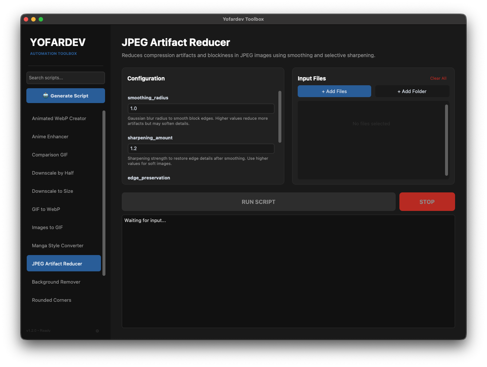

# Yofardev Toolbox

A modern, desktop automation application for image processing tasks. Built with Python and CustomTkinter, it provides a sleek dark-themed interface for running and generating image processing scripts.


## Features

- **Modern UI**: Clean, dark-themed interface built with CustomTkinter
- **Script Library**: 14+ built-in image processing scripts including:
  - Background removal (AI-powered)
  - Image format conversion (GIF, WebP, etc.)
  - Image enhancement (anime, manga, vibrance)
  - Video to image extraction
  - Webcam-style filters
  - And more...
- **LLM-Powered Script Generation**: Create custom scripts using natural language prompts via OpenAI-compatible APIs
- **Real-time Console Output**: View script execution progress in real-time
- **Batch Processing**: Process multiple files or entire folders at once
- **Parameter Configuration**: Easy-to-use UI for configuring script parameters

## Screenshots



The application features a two-panel layout:
- **Left Panel**: Script browser with search functionality
- **Right Panel**: Configuration area, file selection, and console output

## Installation

### Prerequisites

- Python 3.13 or higher
- macOS, Linux, or Windows

### Quick Start with uv

```bash
# Clone the repository
git clone https://github.com/yourusername/yofardev_toolbox.git
cd yofardev_toolbox

# Install dependencies using uv
uv sync

# Run the application
uv run python main.py
```

### Alternative: Using pip

```bash
# Install dependencies
pip install -r requirements.txt

# Run the application
python main.py
```

## Usage

### Running Scripts

1. Select a script from the left sidebar
2. Configure parameters in the Configuration panel
3. Add input files using the "Add Files" or "Add Folder" buttons
4. Click "RUN SCRIPT" to execute
5. Output files are automatically saved to `~/Downloads/<script_name>/`
6. The output folder opens automatically when the script completes

### Generating Custom Scripts (AI-Powered)

1. Click the "🤖 Generate Script" button in the sidebar
2. Click the ⚙️ settings button to configure your LLM API
3. Enter your API details (endpoint, model, API key)
4. Describe the script you want to create
5. Click "Generate Script" to create it
6. The new script appears in the sidebar and is ready to use!

**Supported LLM providers**: Any OpenAI-compatible API (OpenAI, Anthropic, local models via Ollama, etc.)

### Search Scripts

Use the search box at the top of the sidebar to filter scripts by name or description.

## Configuration

### LLM Settings

The application stores LLM configurations in `~/.yofardev_toolbox/llm_config.json`. You can:

- Add multiple LLM configurations
- Switch between different providers
- Edit or delete configurations

### Application Settings

The application uses sensible defaults, but you can customize:
- Window size (`config/app_config.py`)
- Color themes (`config/themes.py`)
- Script directory location

## Architecture

The application follows a clean three-layer architecture:

```
yofardev_toolbox/
├── config/              # Configuration layer
│   ├── app_config.py    # App settings
│   ├── themes.py        # Color schemes and styling
│   └── llm_config.py    # LLM configuration management
│
├── core/                # Business logic layer
│   ├── script_manager.py    # Script discovery and loading
│   ├── script_executor.py   # Process management
│   ├── file_handler.py      # File operations
│   └── llm_generator.py     # LLM integration
│
├── ui/                  # Presentation layer
│   ├── app.py               # Main application window
│   ├── components/          # Reusable UI components
│   │   ├── sidebar.py
│   │   ├── console.py
│   │   └── generator_panel.py
│   └── dialogs/             # Modal dialogs
│       ├── settings_dialog.py
│       └── examples_dialog.py
│
└── scripts/             # User scripts
    ├── remove_bg.py
    ├── webcamify.py
    └── ...
```

## Writing Custom Scripts

You can easily add your own scripts to the `scripts/` directory. Each script must expose the following:

### Required Module Variables

```python
NAME = "My Script Name"
DESCRIPTION = "What this script does"
INPUT_TYPES = "Images (*.png *.jpg *.jpeg)"
PARAMETERS = [
    {
        "name": "param_name",
        "type": "str",  # str, int, float, bool, choice
        "default": "default_value",
        "description": "Parameter description",
        "choices": ["option1", "option2"]  # Required for type="choice"
    }
]
ACCEPTS_MULTIPLE_FILES = True  # Optional, defaults to True
```

### Required Functions

```python
def main(files, output_dir, **kwargs):
    """
    Main entry point for the script.

    Args:
        files: List of file paths
        output_dir: Directory to save outputs
        **kwargs: Parameter values from UI
    """
    # Your processing logic here
    pass

def process_files(file_paths, output_dir, **kwargs):
    """
    Process multiple files.
    Called by the executor for batch processing.
    """
    for file_path in file_paths:
        main([file_path], output_dir, **kwargs)
```

### Example Script

```python
import os
from PIL import Image

NAME = "Image Resizer"
DESCRIPTION = "Resize images to a specified dimension"
INPUT_TYPES = "Images (*.png *.jpg *.jpeg)"
PARAMETERS = [
    {
        "name": "size",
        "type": "int",
        "default": 800,
        "description": "Target width/height in pixels"
    },
    {
        "name": "maintain_aspect",
        "type": "bool",
        "default": True,
        "description": "Maintain aspect ratio"
    }
]

def main(files, output_dir, size, maintain_aspect, **kwargs):
    for file_path in files:
        img = Image.open(file_path)
        if maintain_aspect:
            img.thumbnail((size, size))
        else:
            img = img.resize((size, size))

        output_path = os.path.join(output_dir, f"resized_{os.path.basename(file_path)}")
        img.save(output_path)

def process_files(file_paths, output_dir, **kwargs):
    main(file_paths, output_dir, **kwargs)
```

See `SCRIPT_DOCUMENTATION.md` for detailed guidelines.

## Available Scripts

| Script | Description |
|--------|-------------|
| **Background Remover** | AI-powered background removal using rembg |
| **Animated WebP Creator** | Create animated WebP images |
| **Anime Enhancer** | Enhance anime-style images |
| **Comparison GIF** | Create before/after comparison GIFs |
| **Downscale by Half** | Reduce image size by 50% |
| **Downscale to Size** | Resize to specific dimensions |
| **GIF to WebP** | Convert GIF to WebP format |
| **Images to GIF** | Combine images into GIF |
| **JPEG Artifact Reducer** | Reduce compression artifacts |
| **Manga Style Converter** | Apply manga-style effects |
| **Rounded Corners** | Add rounded corners to images |
| **Vibrance Saturation** | Enhance colors |
| **Video to Images** | Extract frames from video |
| **Webcamify** | Apply webcam-style filters |

## Troubleshooting

### Application won't start

- Ensure Python 3.13+ is installed: `python --version`
- Reinstall dependencies: `uv sync`
- Check that tkinter is available: `python -c "import tkinter"`

### Scripts not appearing in sidebar

- Ensure scripts are in the `scripts/` directory
- Check that script files end with `.py`
- Verify scripts have required `NAME`, `DESCRIPTION`, `PARAMETERS` variables
- Check console output for loading errors

### LLM generation not working

- Verify API key is configured in Settings (⚙️)
- Check that the API endpoint is accessible
- Ensure the model name is correct for your provider
- Check console for error messages

## Development

### Project Structure

The codebase follows a modular architecture with separated concerns:

- **Config Layer**: Settings, themes, and LLM configuration
- **Core Layer**: Business logic for script management and execution
- **UI Layer**: Presentation components and dialogs

### Adding Features

1. **New UI Component**: Add to `ui/components/`
2. **New Dialog**: Add to `ui/dialogs/`
3. **New Core Functionality**: Add to `core/`
4. **New Script**: Add to `scripts/` directory

### Testing

Run scripts directly from command line:
```bash
python scripts/remove_bg.py image.jpg --alpha_matting True
```

## Contributing

Contributions are welcome! Please:

1. Fork the repository
2. Create a feature branch
3. Make your changes
4. Test thoroughly
5. Submit a pull request

## License

MIT License - feel free to use this project for personal or commercial purposes.

## Acknowledgments

- **CustomTkinter** for the modern UI framework
- **Pillow** for image processing
- **rembg** for AI background removal
- All open-source contributors

## Contact

For issues, questions, or suggestions, please open an issue on GitHub.

---

**Version**: 1.2.0
**Last Updated**: 2025
